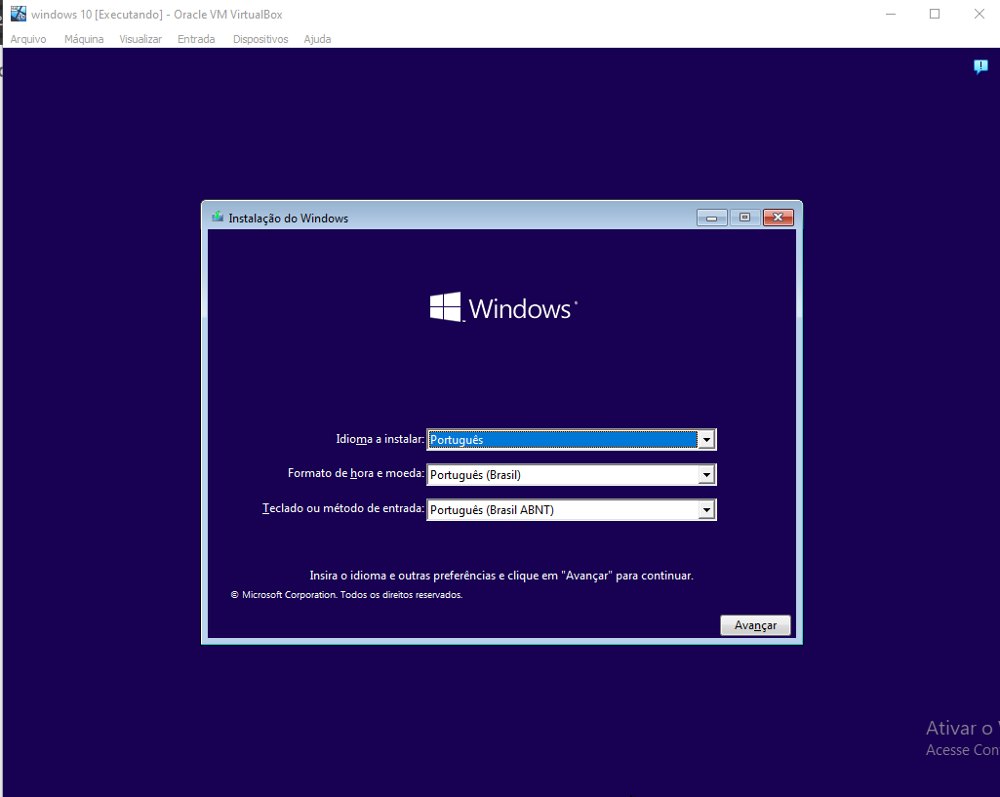

# windows-10
instalação do windows 10

## Pré- requisitos
- 4GB de RAM
- 50GB de armazenamento
- ISO do Windows 10

### Passo 1
Vamos começar selecionando o idioma, fuso e formato do teclado.

### Passo 2
Comece a instalação e aguarde, colocaremos a Key caso já possuimos.

### Passo 3
Comece a instalação e aguarde, colocaremos a Key caso já possuimos.
